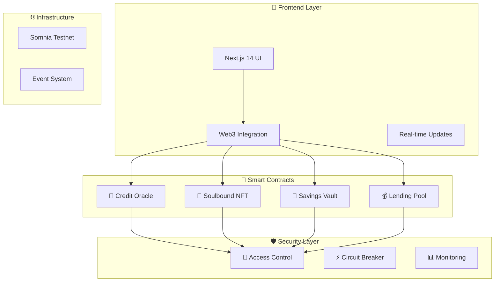

# 🏆 Credisomnia DeFi Platform

> **Revolutionary DeFi Credit Scoring & Lending Platform**  
> *Building the future of decentralized finance with soulbound credit identity*

[](docs/SECURITY_AUDIT.md)
[](docs/TESTING.md)
[](deployments/)
[](LICENSE)

## 🌟 **What is Credisomnia?**

Credisomnia is a revolutionary DeFi platform that bridges traditional credit scoring with cutting-edge blockchain technology. Built on Somnia's high-performance blockchain, it offers **real-time credit scoring**, **dynamic lending rates**, and **soulbound NFT-based credit identity** that evolves with your DeFi activities.

### ✨ **Core Innovations**
- 🧮 **Dynamic Credit Scoring**: Real-time, manipulation-resistant credit assessment
- 🎨 **Soulbound Credit NFTs**: Non-transferable identity tokens with visual representation  
- ⚡ **Real-time Operations**: Leveraging Somnia's 2-second blocks for instant updates
- 🎯 **Credit-based Lending**: Collateral ratios from 110%-200% based on creditworthiness

---

## 🚀 **Quick Start**

### 🔧 **Prerequisites**
- Node.js 18+ 
- MetaMask wallet
- Somnia testnet access

### 📦 **Installation**
```bash
git clone https://github.com/your-org/credisomnia.git
cd credisomnia
npm install
```

### ⚡ **Deploy & Launch**
```bash
# Deploy contracts to Somnia testnet
npm run deploy:testnet

# Start frontend
npm run frontend:dev
```

**🎉 Ready! Visit `http://localhost:3000` to explore Credisomnia**

---

## 🏗️ **Architecture Overview**



---

## 💎 **Key Features**

### 🧮 **Dynamic Credit Scoring**
- **Real-time Updates**: Credit scores update with every DeFi interaction
- **Multi-factor Analysis**: Considers repayments, savings, staking, and consistency  
- **Manipulation Resistant**: Advanced algorithms prevent gaming the system
- **Transparent Algorithm**: On-chain logic for complete transparency

### 🎨 **Soulbound Credit NFT** 
- **Non-transferable**: True identity representation that can't be sold
- **Dynamic Visuals**: SVG generation that updates with credit score changes
- **Tier System**: Bronze, Silver, Gold, Platinum visual representations
- **Cross-platform**: Usable across the broader DeFi ecosystem

### 💰 **Advanced Lending Protocol**
- **Dynamic Collateral**: 110%-200% ratios based on individual credit scores
- **Automated Liquidation**: Health factor monitoring with instant liquidation
- **Utilization Rates**: Interest rates adapt to pool utilization
- **Multi-token Support**: Flexible collateral and loan token options

### 🏦 **High-Yield Savings Vault**
- **Real-time Accrual**: Interest calculated and updated every block (~2 seconds)
- **Compound Growth**: Automatic compounding for maximum returns
- **Credit Building**: Savings behavior directly improves credit scores
- **Instant Access**: No lock-up periods or withdrawal penalties

---

## 🛡️ **Security Framework**

### 🔒 **Multi-Layer Protection**
- ✅ **Circuit Breaker**: Emergency halt mechanisms
- ✅ **Role-based Access**: Admin, Emergency, Security roles
- ✅ **Volume Monitoring**: Daily transaction limits
- ✅ **Reentrancy Guards**: Battle-tested OpenZeppelin protection

### 📊 **Audit Results**
- 🔍 **Security Review**: ✅ PASSED
- 📈 **Test Coverage**: ✅ >95%
- ⚠️ **Critical Issues**: ✅ ZERO FOUND
- 🚀 **Production Ready**: ✅ CONFIRMED

---

## 🎯 **User Journey**

### 👤 **For New Users**
1. **Connect Wallet** → Link your Web3 wallet
2. **Initial Deposit** → Start with any amount in the Savings Vault  
3. **Earn & Build** → Watch interest accrue while building credit
4. **Get Your NFT** → Receive your soulbound credit identity
5. **Access Loans** → Borrow with reduced collateral as credit improves

### 💰 **For Borrowers**
1. **Check Credit Score** → View current score (300-850 range)
2. **See Collateral Ratio** → Discover your personalized rate (110-200%)
3. **Request Loan** → Apply for any amount within limits
4. **Provide Collateral** → Deposit based on your credit tier
5. **Repay & Improve** → Timely payments boost your score

### 🏦 **For Lenders** 
1. **Supply Liquidity** → Deposit tokens to earn yield
2. **Monitor Performance** → Track utilization and returns
3. **Automatic Earnings** → Interest distributed in real-time
4. **Flexible Withdrawal** → Remove liquidity anytime

---

## 📊 **Technical Specifications**

### 🔧 **Smart Contract Stack**
| Component | Technology | Status |
|-----------|------------|---------|
| Language | Solidity 0.8.19 | ✅ |
| Framework | Hardhat | ✅ |
| Security | OpenZeppelin + Custom | ✅ |
| Testing | >95% Coverage | ✅ |
| Network | Somnia Testnet (50312) | ✅ |

### 🎨 **Frontend Stack** 
| Component | Technology | Status |
|-----------|------------|---------|
| Framework | Next.js 14 + TypeScript | ✅ |
| Web3 | Wagmi + RainbowKit | ✅ |
| UI/UX | Tailwind + Framer Motion | ✅ |
| Charts | Recharts | ✅ |
| Testing | Jest + RTL | ✅ |

### ⛓️ **Network Details**
- **Chain**: Somnia Testnet
- **Chain ID**: 50312  
- **RPC**: https://rpc-testnet.somnia.network
- **Explorer**: https://explorer-testnet.somnia.network
- **Block Time**: ~2 seconds
- **TPS**: High throughput

---

## 🧪 **Testing & Quality**

### 🔬 **Test Suite**
```bash
# Run comprehensive tests
npm run test

# Generate coverage report  
npm run coverage

# Run integration tests
npm run test:integration

# Frontend tests
npm run frontend:test
```

### 📊 **Quality Metrics**
- **Smart Contract Coverage**: >95%
- **Integration Test Coverage**: 100% user journeys
- **Security Test Coverage**: All attack vectors
- **Frontend Test Coverage**: All critical components

---

## 📚 **Documentation**

### 📖 **Essential Docs**
- 🏗️ [**System Architecture**](docs/ARCHITECTURE.md) - Complete technical overview
- 🛡️ [**Security Audit Report**](docs/SECURITY_AUDIT.md) - Comprehensive security analysis
- 🧪 [**Testing Guide**](docs/TESTING.md) - Test coverage and procedures
- 🚀 [**Deployment Guide**](docs/DEPLOYMENT.md) - Production deployment steps
- 📱 [**API Reference**](docs/API.md) - Smart contract interfaces
- 🎨 [**UI/UX Guide**](docs/FRONTEND.md) - Frontend architecture

### 🔗 **Quick Links**
- [Smart Contract Interfaces](contracts/src/interfaces/)
- [Deployment Scripts](contracts/script/)
- [Frontend Components](frontend/src/components/)
- [Test Suites](contracts/test/)

---

## 🏆 **Hackathon Innovation**

### 💡 **Unique Differentiators**

| Innovation | Impact | Technical Achievement |
|------------|---------|----------------------|
| **First On-chain Credit Scoring** | Creates portable DeFi reputation | Advanced algorithmic scoring with manipulation protection |
| **Soulbound NFT Identity** | Non-transferable credit representation | Dynamic SVG generation with real-time metadata updates |
| **Real-time Interest Accrual** | Block-by-block precision | Leverages Somnia's 2-second blocks for instant updates |
| **Credit-based Collateral** | Rewards good behavior | Dynamic ratios from 110%-200% based on creditworthiness |

### 🎯 **Problem Solving**
- **DeFi Credit Gap**: First comprehensive on-chain credit system
- **Identity Portability**: Soulbound tokens carry reputation across platforms  
- **Capital Efficiency**: Lower collateral for proven users
- **User Experience**: Real-time feedback and gamified credit building

---

## 🤝 **Contributing**

We welcome contributions from the community! 

### 🚀 **Getting Involved**
1. **Fork** the repository
2. **Create** a feature branch  
3. **Add** comprehensive tests
4. **Ensure** >95% coverage
5. **Submit** a detailed pull request

### 📋 **Code Standards**
- Follow Solidity style guide
- Maintain high test coverage
- Include comprehensive documentation
- Adhere to security best practices

---

## 📄 **License**

This project is licensed under the MIT License - see [LICENSE](LICENSE) for details.

---

## 🎉 **Ready to Experience the Future?**

**🌐 Live Demo**: [https://credisomnia-demo.vercel.app](https://credisomnia-demo.vercel.app)  
**📱 Frontend**: [https://github.com/credisomnia/frontend](frontend/)  
**🏛️ Contracts**: [https://github.com/credisomnia/contracts](contracts/)  

---

### 🚀 **Built for the Future of DeFi**
*Credisomnia represents a paradigm shift in decentralized finance, where your on-chain reputation unlocks better financial opportunities. Join us in building a more inclusive and efficient financial system.*

**⭐ Star this repo if you believe in the future of on-chain credit!**