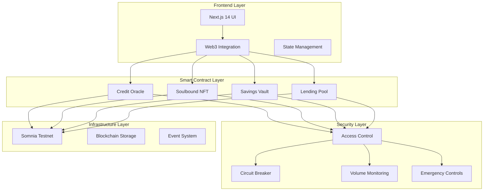
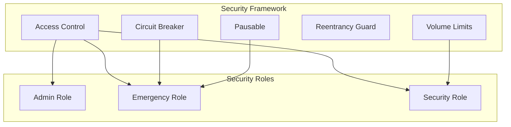
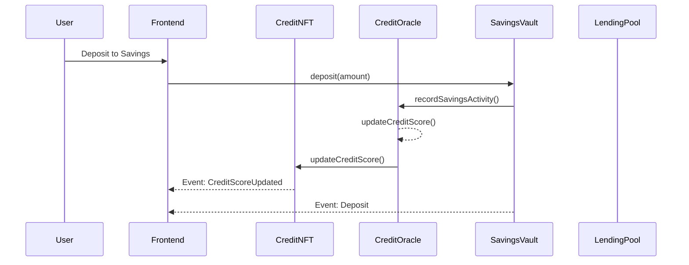
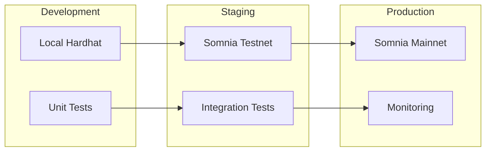

# Credisomnia DeFi Platform - System Architecture

## 📋 Executive Summary

The Credisomnia DeFi platform represents a comprehensive solution for decentralized credit scoring and lending, built with production-ready security standards and architectural best practices. This document provides detailed technical specifications for the platform's architecture, security framework, and implementation decisions.

## 🏗️ High-Level Architecture

### System Overview



## 🔧 Component Architecture

### 1. Credit Oracle (`CreditOracle.sol`)

**Purpose**: Central credit scoring engine that tracks user DeFi activities and calculates dynamic credit scores.

**Key Features**:
- Real-time credit score calculations
- Multi-factor scoring algorithm
- Activity tracking (repayments, savings, staking)
- Dynamic collateral requirement calculations
- Cooling-down periods to prevent manipulation

**Architecture Decisions**:
- Inheritance from `CredisomniaSecurity` for comprehensive security
- Event-driven design for real-time updates
- Modular scoring weights for algorithm flexibility
- Gas-optimized calculations with SafeMath

**Security Measures**:
- Authorization-only access for score updates
- Volume limits to prevent abuse
- Input validation on all parameters
- Score update cooldowns (1 hour minimum)

### 2. Soulbound Credit NFT (`CreditNFT.sol`)

**Purpose**: Non-transferable NFT representing user credit scores with dynamic visual metadata.

**Key Features**:
- Soulbound token implementation (transfer disabled)
- Dynamic SVG generation based on credit score
- Real-time metadata updates
- Credit tier classification
- Visual score representation

**Architecture Decisions**:
- ERC721 base with transfer restrictions
- On-chain SVG generation for decentralization
- Base64 encoded metadata for compatibility
- Color-coded credit tiers for visual clarity

**Security Measures**:
- Transfer functions disabled at contract level
- Role-based minting and updating permissions
- Metadata validation before updates
- Emergency burn functionality for admin

### 3. Savings Vault (`SavingsVault.sol`)

**Purpose**: High-yield savings product with real-time interest accrual leveraging Somnia's high TPS.

**Key Features**:
- Real-time interest calculations per block
- Compound interest accrual
- Flexible deposit/withdrawal mechanisms
- Credit Oracle integration
- Reserve fund management

**Architecture Decisions**:
- Block-based interest calculations for precision
- Separate principal and interest tracking
- Reserve fund separation for sustainability
- Gas-optimized interest updates

**Security Measures**:
- Reentrancy protection on all functions
- Minimum/maximum deposit limits
- Reserve balance management
- Emergency withdrawal capabilities

### 4. Lending Pool (`LendingPool.sol`)

**Purpose**: Decentralized lending with dynamic collateral ratios based on credit scores.

**Key Features**:
- Dynamic collateral ratios (110%-200% based on credit score)
- Automated liquidation mechanisms
- Interest rate calculations based on utilization
- Loan lifecycle management
- Health factor monitoring

**Architecture Decisions**:
- Utilization-based interest rate model
- Health factor calculations for liquidation
- Loan status state machine
- Gas-efficient batch operations

**Security Measures**:
- Comprehensive loan validation
- Health factor monitoring
- Automated liquidation triggers
- Grace period for defaulted loans

## 🛡️ Security Architecture

### Security Framework (`CredisomniaSecurity.sol`)

The security framework provides a comprehensive foundation for all platform contracts:



### Multi-Layer Security Model

1. **Contract Level Security**
   - OpenZeppelin battle-tested libraries
   - Reentrancy guards on all state-changing functions
   - Input validation and sanitization
   - Safe arithmetic operations

2. **Protocol Level Security**
   - Circuit breaker mechanisms
   - Daily volume monitoring
   - Role-based access control
   - Emergency pause functionality

3. **Economic Security**
   - Liquidation mechanisms
   - Collateral requirements
   - Interest rate management
   - Reserve fund protection

### Security Roles and Permissions

| Role | Permissions | Use Cases |
|------|-------------|-----------|
| **Admin** | Contract upgrades, parameter updates, role management | Routine maintenance, system optimization |
| **Emergency** | Circuit breaker activation, emergency pause, fund recovery | Security incidents, system emergencies |
| **Security** | Monitoring controls, volume limit enforcement | Daily operations, security monitoring |

## 🌐 Network Architecture

### Somnia Testnet Integration

**Network Specifications**:
- **Chain ID**: 50312
- **Block Time**: ~2 seconds
- **TPS**: High throughput capability
- **Finality**: Fast finality for real-time operations

**Architecture Benefits**:
- Real-time interest accrual with 2-second blocks
- Low transaction costs for frequent updates
- High throughput for scalable operations
- Fast finality for immediate confirmations

### Gas Optimization Strategy

1. **Smart Contract Optimizations**
   - Packed structs for storage efficiency
   - Batch operations where possible
   - Efficient loop implementations
   - Minimal external calls

2. **Frontend Optimizations**
   - Multicall for batch operations
   - Local state caching
   - Optimistic UI updates
   - Gas price optimization

## 💾 Data Architecture

### On-Chain Data Structure

```solidity
// Credit Profile Structure
struct CreditProfile {
    uint256 creditScore;           // Current score (300-850)
    uint256 totalRepayments;       // Lifetime repayments
    uint256 onTimeRepayments;      // On-time payment count
    uint256 lateRepayments;        // Late payment count
    uint256 totalSavings;          // Total savings deposited
    uint256 totalStaked;           // Weighted staking amount
    uint256 lastScoreUpdate;       // Last update timestamp
    uint256 repaymentStreak;       // Current streak
    bool isInitialized;            // Profile initialization flag
}

// Savings Account Structure
struct SavingsAccount {
    uint256 principal;              // Original deposit
    uint256 accruedInterest;        // Interest earned
    uint256 lastUpdateBlock;        // Last calculation block
    uint256 depositTimestamp;       // Account creation time
    bool isActive;                  // Account status
}

// Loan Structure
struct Loan {
    uint256 loanId;                 // Unique identifier
    address borrower;               // Borrower address
    uint256 principalAmount;        // Original loan amount
    uint256 outstandingAmount;      // Remaining balance
    uint256 collateralAmount;       // Collateral provided
    uint256 interestRate;           // APY in basis points
    uint256 startTimestamp;         // Loan start time
    uint256 dueTimestamp;           // Loan due date
    uint256 lastPaymentTime;        // Last payment timestamp
    LoanStatus status;              // Current status
}
```

### Event Architecture

The platform uses a comprehensive event system for real-time updates:

```solidity
// Credit Oracle Events
event CreditScoreUpdated(address indexed user, uint256 oldScore, uint256 newScore);
event RepaymentRecorded(address indexed user, uint256 amount, bool onTime);
event SavingsActivityRecorded(address indexed user, uint256 amount, bool isDeposit);

// Savings Vault Events
event Deposit(address indexed user, uint256 amount, uint256 newBalance);
event InterestAccrued(address indexed user, uint256 interest, uint256 newBalance);

// Lending Pool Events
event LoanIssued(uint256 indexed loanId, address indexed borrower, uint256 amount);
event LoanRepaid(uint256 indexed loanId, address indexed borrower, uint256 amount);
```

## 🔄 Integration Architecture

### Contract Interaction Flow



### Frontend Integration

**Web3 Stack**:
- **Wagmi**: Type-safe Ethereum interactions
- **RainbowKit**: Wallet connection management
- **Ethers.js**: Blockchain interaction library
- **TanStack Query**: Server state management

**Real-Time Updates**:
- Event subscription for contract updates
- Optimistic UI updates for better UX
- Automatic retry mechanisms for failed transactions
- Connection state management

## 📊 Performance Architecture

### Scalability Considerations

1. **Smart Contract Optimization**
   - Gas-efficient algorithms
   - Minimal storage operations
   - Batch processing capabilities
   - Lazy evaluation where possible

2. **Frontend Performance**
   - Component lazy loading
   - Efficient re-rendering strategies
   - Cached contract calls
   - Progressive data loading

### Monitoring and Metrics

**Key Performance Indicators**:
- Transaction success rate
- Average gas consumption
- Frontend response times
- User engagement metrics
- Protocol utilization rates

## 🚀 Deployment Architecture

### Environment Management



### Continuous Integration/Deployment

1. **Smart Contract Pipeline**
   - Automated testing on every commit
   - Gas usage optimization checks
   - Security analysis with Slither/Mythril
   - Deployment to testnet for integration testing

2. **Frontend Pipeline**
   - Type checking and linting
   - Component testing
   - Build optimization
   - Deployment to staging/production

## 🎯 Future Architecture Considerations

### Scalability Roadmap

1. **Layer 2 Integration**
   - Multi-chain deployment strategy
   - Cross-chain credit score portability
   - Unified liquidity across chains

2. **Advanced Features**
   - Machine learning credit scoring
   - DeFi protocol integrations
   - Governance token implementation
   - Advanced liquidation strategies

3. **Enterprise Features**
   - Institutional lending products
   - Credit scoring APIs
   - White-label solutions
   - Compliance frameworks

## 📋 Architecture Decision Records (ADRs)

### ADR-001: Soulbound NFT Implementation
**Decision**: Implement credit scores as soulbound NFTs rather than simple mappings
**Rationale**: Enhanced portability, visual representation, and standardization
**Consequences**: Increased gas costs, but better user experience and interoperability

### ADR-002: Block-Based Interest Calculation
**Decision**: Calculate interest per block rather than per second
**Rationale**: More predictable and gas-efficient on blockchain
**Consequences**: Requires careful block time assumptions and periodic recalibration

### ADR-003: Modular Security Framework
**Decision**: Implement security as an inherited base contract
**Rationale**: Consistent security across all contracts, easier maintenance
**Consequences**: Increased contract size, but improved security posture

### ADR-004: Dynamic Collateral Ratios
**Decision**: Implement credit-score-based collateral requirements
**Rationale**: Incentivizes good credit behavior and reduces capital inefficiency
**Consequences**: Complex calculation logic, but improved user economics

## 🔍 Architecture Review and Validation

### Code Quality Metrics
- **Test Coverage**: Target >95% line coverage
- **Cyclomatic Complexity**: Maximum 10 per function
- **Documentation Coverage**: 100% NatSpec coverage
- **Security Review**: Multi-stage security audits

### Performance Benchmarks
- **Gas Usage**: <200k gas per transaction target
- **Frontend Load Time**: <2 seconds first contentful paint
- **Transaction Confirmation**: <10 seconds average
- **API Response Time**: <500ms for read operations

This architecture provides a solid foundation for a production-ready DeFi credit scoring and lending platform, with comprehensive security measures, optimal performance characteristics, and scalable design patterns.